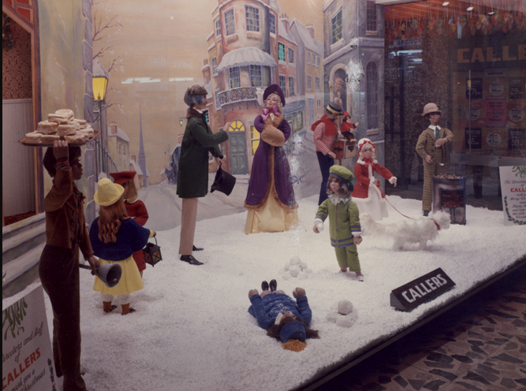
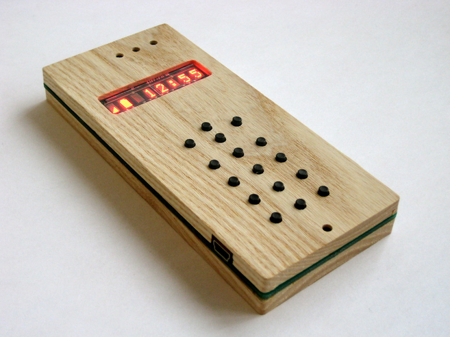
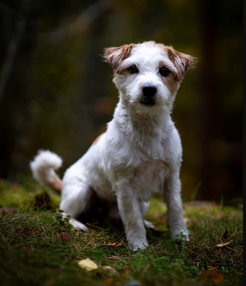
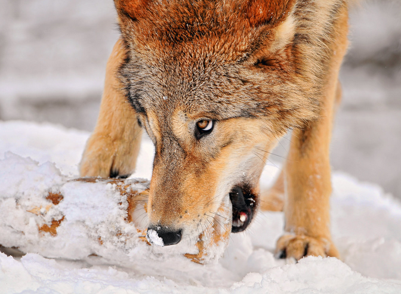
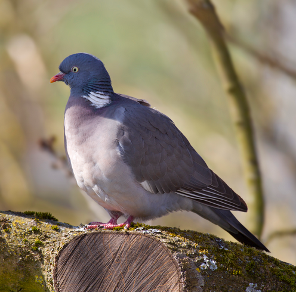
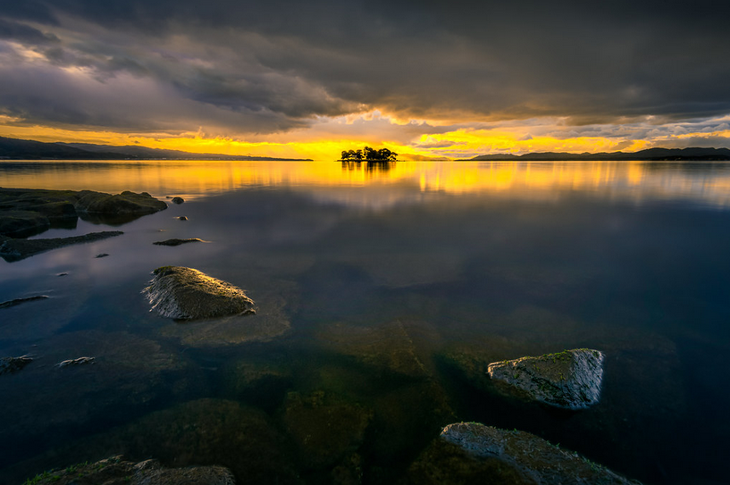

# Tarea 5.7

| Licencia                | Imagen (miniatura)                   | Autor            | URL                                |
|-------------------------|--------------------------------------|------------------|------------------------------------|
| Dominio público         |  | Newcastle Libraries         | [Dominio Público](https://openverse.org/image/80ef57ef-155e-44b5-a3cd-acad67811b89?q=wood&p=14) |
| CC BY                   |  | dam       | [CC BY](https://openverse.org/image/e0fe6e31-c2d1-472c-b6c7-46eb073cefd1?q=wood&p=16) |
| CC BY-NC                |  | J.Hernetkoski    | [CC BY-NC](https://openverse.org/image/b796446f-5c97-4998-8ca9-63bcd18a3757?q=wood&p=22) |
| CC BY-ND                |  | Tambako the Jaguar        | [CC BY-ND](https://openverse.org/image/14f9ce05-b929-40b0-aa65-d508bcf8c0ac?q=wood&p=3) |
| CC BY-SA                |  | Andreas Trepte    | [CC BY-SA](https://openverse.org/image/8ad43891-88f6-47fc-94a0-2e00ba0ca68b?q=wood&p=27) |
| Todos los derechos reservados |  | Junji Aoyama      | [Derechos Reservados](https://www.flickr.com/photos/142474085@N03/54408610759/in/explore-2025-03-25/) |
